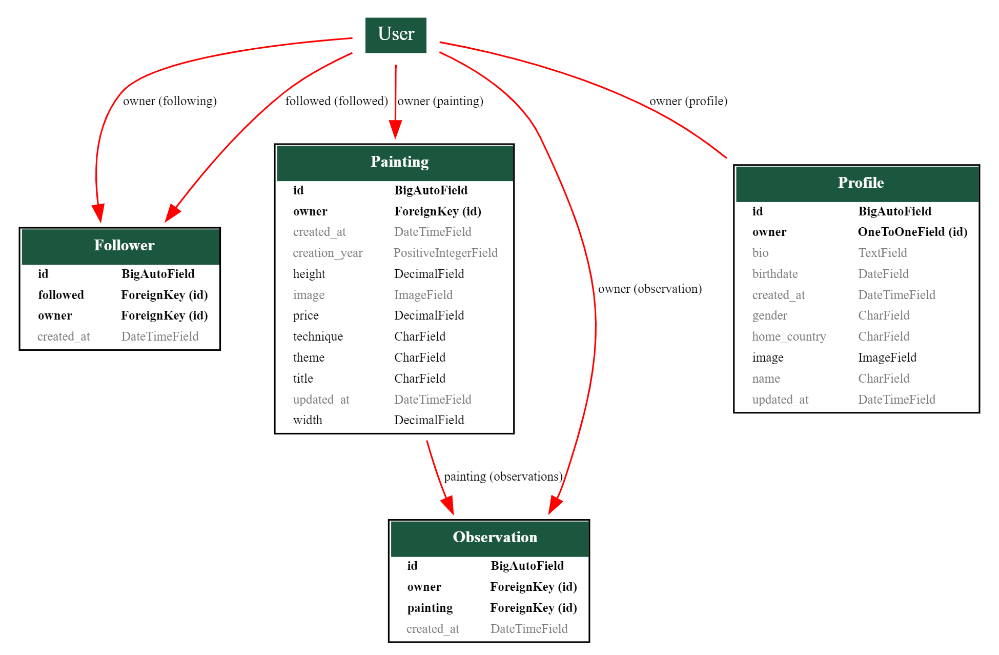

# **ART SHOWCASE - Django REST Framework API**

This repository is the back-end REST API which is used by my front-end 
project.

You can view the live site here - [ART SHOWCASE](https://pp-5-art-showcase-1029cf70a456.herokuapp.com/)

You can view the live API here - [ART SHOWCASE API](https://pp-5-drf-api-cb9dad6bdfdf.herokuapp.com/)

You can view the front-end README.md here - [ART SHOWCASE Front-End README](https://github.com/gennadiy-gaysha/PP_5_art_showcase)

You can view the back-end README.md here - [ART SHOWCASE Back-End README](https://github.com/gennadiy-gaysha/PP_5_rest_api)

# Contents

- [**Objective**](#objective)
- [**Entity Relationship Diagram**](#entity-relationship-diagram)
- [**Database**](#database)
- [**Models**](#models)
- [**Testing**](#testing)
  - [**Manual Testing**](#manual-testing)
  - [**PEP8 Validation**](#pep8-validation)
  - [**Bugs Fixed**](#bugs-fixed)
  - [**Bugs Unresolved**](#bugs-unresolved)
- [**Technologies Used**](#technologies-used)
- [**Deployment To Heroku**](#deployment-to-heroku)
- [**Cloning This Project**](#cloning-and-setting-up-this-project)
- [**Credits**](#credits)
  - [**Content**](#content)
  - [**Media**](#media)
- [**Acknowledgments**](#acknowledgements)

## Objective

The purpose of this API is to deliver a robust, efficient, and secure data 
backbone for the 
[ART SHOWCASE](https://pp-5-art-showcase-1029cf70a456.herokuapp.com/) 
front-end project. My goal is to develop straightforward, clear, and functional 
models that accurately represent the necessary data for the project. Each API 
endpoint is designed with a specific function in mind, ensuring that data 
interactions are intuitive and meet the project's needs. Comprehensive testing 
is conducted to secure these endpoints against unauthorized Create, Read, 
Update, and Delete operations, safeguarding the integrity and privacy of the 
data.

## Entity Relationship Diagram

To create Entity Relationship Diagram I followed these steps:

- Install Django-Extensions:
`pip install django-extensions`
- Add Django-Extensions to INSTALLED_APPS in project's settings.py file:
```python
INSTALLED_APPS = [
    'django_extensions',
]
```
- Create a `PP_5_drf_api_erd.dot` file using the graph_models command with 
various options for the models created in my project:
`(venv) PS C:\PP_5_drf_api> python manage.py graph_models followers observations paintings profiles --rankdir BT --color-code-deletions --arrow-shape normal -o PP_5_drf_api_erd.dot`
- Copy the entire content of PP_5_drf_api_erd.dot file and paste it into 
  [dreampuf](https://dreampuf.github.io/GraphvizOnline/) service left window
- Download the ERD generated in the right window in png format.

Below is the Entity Relationship Diagram for the PP_5_drf_api project:



<br>[Back to top ⇧](#contents)