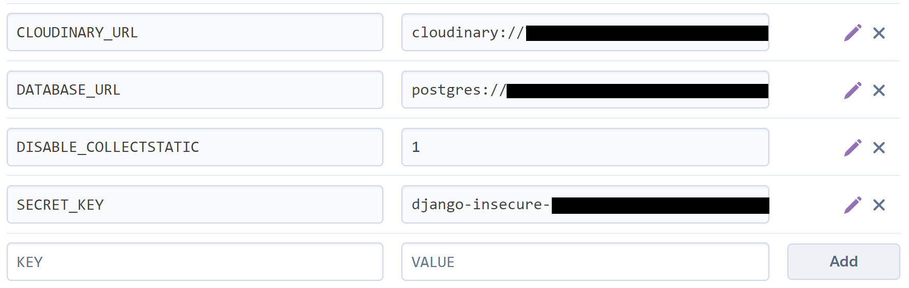

# **ART SHOWCASE - Django REST Framework API**

This repository is the back-end REST API which is used by my front-end 
project.

You can view the live site here - [ART SHOWCASE](https://pp-5-art-showcase-1029cf70a456.herokuapp.com/)

You can view the live API here - [ART SHOWCASE API](https://pp-5-drf-api-cb9dad6bdfdf.herokuapp.com/)

You can view the front-end README.md here - [ART SHOWCASE Front-End README](https://github.com/gennadiy-gaysha/PP_5_art_showcase)

You can view the back-end README.md here - [ART SHOWCASE Back-End README](https://github.com/gennadiy-gaysha/PP_5_rest_api)

# Contents

- [**Objective**](#objective)
- [**Entity Relationship Diagram**](#entity-relationship-diagram)
- [**Apps and Models**](#apps-and-models)
  - [Paintings app](#paintings-app)
  - [Profiles app](#profiles-app)
  - [Comments app](#comments-app)
  - [Followers app](#followers-app)
  - [Observations app](#observations-app)
  
- [**Testing**](#testing)
  - [**Manual Testing**](#manual-testing)
  - [**PyCharm Code Inspections**](#pycharm-code-inspections)
- [**Technologies Used**](#technologies-used)
- [**Database setup**](#database-setup)
- [**Deployment To Heroku**](#deployment-to-heroku)
- [**Cloning and Forking Repository**](#cloning-and-forking-repository)
  - [Cloning the Repository](#cloning-the-repository)
  - [Forking the Repository](#forking-the-repository)
- [**Credits**](#credits)
  - [**Content**](#content)
  - [**Media**](#media)
- [**Acknowledgments**](#acknowledgements)

## Objective

The purpose of this API is to deliver a robust, efficient, and secure data 
backbone for the 
[ART SHOWCASE](https://pp-5-art-showcase-1029cf70a456.herokuapp.com/) 
front-end project. My goal is to develop straightforward, clear, and functional 
models that accurately represent the necessary data for the project. Each API 
endpoint is designed with a specific function in mind, ensuring that data 
interactions are intuitive and meet the project's needs. Comprehensive testing 
is conducted to secure these endpoints against unauthorized Create, Read, 
Update, and Delete operations, safeguarding the integrity and privacy of the 
data.

## Entity Relationship Diagram

To create Entity Relationship Diagram I followed these steps:

- Install Django-Extensions:
`pip install django-extensions`
- Add Django-Extensions to INSTALLED_APPS in project's settings.py file:
```python
INSTALLED_APPS = [
    'django_extensions',
]
```
- Create a `PP_5_drf_api_erd.dot` file using the graph_models command with 
various options for the models created in my project:
`(venv) PS C:\PP_5_drf_api> python manage.py graph_models followers observations paintings profiles --rankdir BT --color-code-deletions --arrow-shape normal -o PP_5_drf_api_erd.dot`
- Copy the entire content of PP_5_drf_api_erd.dot file and paste it into 
  [dreampuf](https://dreampuf.github.io/GraphvizOnline/) service left window
- Download the ERD generated in the right window in png format.

Below is the Entity Relationship Diagram for the PP_5_drf_api project:


<br>[Back to top ⇧](#contents)

## Apps and Models

### Paintings app

#### **Painting Model Fields**

1. **Owner**: The user who created the painting. This ForeignKey ties the 
painting directly to a user account and is crucial for ownership and permission 
checks.
   
2. **Created At & Updated At**: Timestamps for when the painting was created 
and last updated. These are automatically managed by Django and used for sorting 
and displaying recent activity.
   
3. **Title**: A string field holding the painting’s title. This is crucial for 
display and search operations.
   
4. **Creation Year**: A numeric field that stores the year the painting was 
created. It is also used in validations to ensure the year falls within an 
acceptable range.
   
5. **Technique & Theme**: These fields use predefined choices to categorize 
paintings, which help in filtering and searching paintings based on these 
attributes.
   
6. **Width & Height**: Decimal fields used to store dimensions of the painting. 
These are used in the serializer to determine the orientation of the painting.
   
7. **Price**: The cost of the painting. This field can be used in filters to 
sort or search for paintings within specific price ranges.
   
8. **Image**: A field for uploading an image file associated with the painting, 
crucial for visual representation in the UI.

#### **Filters**

Using `django_filters`, the `PaintingFilter` class enables filtering paintings 
based on their `theme`, `technique`, and other relational attributes such as 
`owner__followed__owner__profile` (to filter paintings by followed users). 
Additionally, the custom method `filter_orientation` allows filtering by 
painting orientation, which is determined by comparing the width and height 
fields.

- **Orientation Filter**: Custom filter logic is applied to determine if a 
painting is Horizontal, Vertical, or Square based on its width and height, 
enhancing the user’s ability to sort and view paintings as per their spatial 
preferences.

#### **Serializers**

The `PaintingSerializer` transforms model instances into JSON format for API 
responses and helps in validating and deserializing input data to Django model 
instances.

- **Read-Only Fields**: Such as `owner.username`, `profile_id`, and 
`profile_image`, provide contextual information about the painting's owner 
without allowing API consumers to modify these values directly.
   
- **Method Fields**: `get_is_owner` and `get_orientation` are methods defined 
in the serializer to add more context to the serialization process. 
`get_is_owner` checks if the request user is the owner of the painting, and 
`get_orientation` provides the orientation based on dimensions.
   
- **Validation Methods**: Custom methods like `validate_creation_year` and 
`validate_image` ensure that the input data adheres to specific constraints 
(e.g., valid year range, image size and dimensions).

- **Observations and Comments Counts**: These fields are annotated in the 
queryset to provide aggregated data directly in the painting listings, useful 
for displaying popularity and engagement without additional queries.

#### **View Layer Integration**

In the views, particularly in list and detail views like `PaintingList` and 
`PaintingDetail`, the serializer and filters are applied to control the 
presentation and querying of painting data. Permissions are managed to restrict 
operations like editing and deleting to rightful owners or authorized users 
only. The integration of filters with search and ordering backends enhances 
the API's flexibility, allowing users to find and sort paintings based on 
multiple criteria effectively.

<br>[Back to top ⇧](#contents)

### Profiles app

The **Profile** model in my Django project is designed to extend the built-in 
User model by adding additional fields and functionality specific to 
application's needs.

#### **Profile Model Fields**

1. **Owner**: A one-to-one link to the Django User model. This ensures that 
each user has only one corresponding profile, and deleting the user will also 
delete the profile.

2. **Created At & Updated At**: Automatically managed timestamps that record 
when the profile was created and last updated.

3. **Name**: A string field that can be left blank, used to store the user's 
name up to 255 characters.

4. **Bio**: A text field for a biography or description about the user, which 
can also be left blank.

5. **Home Country**: A character field for storing the user's home country, up 
to 100 characters, and can be left blank.

6. **Gender**: A choice field with options for 'Male', 'Female', and 'Other', 
allowing the user to specify their gender or leave it blank.

7. **Birthdate**: A date field that can store the user's birthdate or be left 
null.

8. **Image**: An image field for uploading a profile picture, using Cloudinary 
for storage, with a default image specified.

#### **Serializers**

The `ProfileSerializer` is responsible for converting Profile instances into 
JSON format for API responses and handling data input for creating or updating 
profiles.

- **Read-Only Fields**: Such as `owner.username` and `owner.email`, ensure that 
the username and email from the User model are included in the profile 
serialization without being editable directly through the Profile API.

- **Method Fields** (`is_owner` and `following_id`): These fields add dynamic 
content based on the request context, not directly stored in the database but 
computed on-the-fly.
   - `is_owner`: Checks if the authenticated user requesting the profile data 
owns the profile, useful for conditional rendering in the client application.
   - `following_id`: Identifies if the authenticated user follows the profile 
owner, helping in managing follow status.

#### **Views and Filters**

- **ProfileList** and **ProfileDetail**: These views handle the retrieval and 
modification of Profile data using the `ProfileSerializer`. They include 
annotations to count related paintings, followers, and followings, which enrich 
he profile data with social interaction metrics.

- **Filters**: The profiles can be filtered by relationships, such as finding 
profiles followed by a specific user or those who follow a specific user. This 
is enabled by the DjangoFilterBackend.

- **Permissions**: The `IsOwnerOrReadOnly` permission ensures that only the 
owner of a profile can edit it, while others can only read the data, 
maintaining privacy and security.

#### **Additional Functionalities**

- **Signal Handling**: A signal (`post_save` on User) automatically creates a 
Profile instance when a new User is created, ensuring data consistency.

- **Custom Methods in Serializer**:
   - Validation methods in the serializer ensure that the birthdate and image 
adhere to specific rules (e.g., birthdate should be a valid past date, image 
file size and dimensions checks).
   - Custom methods for `is_owner` and `following_id` enhance the API's 
response by including user-specific interaction data.

<br>[Back to top ⇧](#contents)

### Comments app

The **Comment** model and its associated serializers and views in my Django 
project are designed to manage user comments on paintings efficiently. Here’s 
a detailed explanation of how the Comment model works within the application, 
including interactions with serializers and views.

#### **Comment Model**

1. **Owner**: A ForeignKey to Django's User model. This field identifies the 
user who created the comment, linking a comment to its author. Deletion of a 
user leads to the deletion of all their comments due to the `CASCADE` deletion 
policy.

2. **Painting**: A ForeignKey linking the comment to a specific painting. This 
association ensures that each comment is attached to a painting, and deleting 
the painting will also remove its associated comments.

3. **Created At & Updated At**: Automatically set timestamps that record when 
the comment was created and last updated, providing a temporal context for 
comments.

4. **Content**: A TextField to store the body of the comment. This field holds 
the actual comment text entered by the user.

#### **Serializers**

- **CommentSerializer**: Converts comment instances to JSON format for API 
responses, handling data input for creating or updating comments.
  - **Read-Only Fields**: Such as `owner.username`, `owner.profile.id`, and 
`owner.profile.image.url` to include owner details in the serialization.
  - **Method Fields** (`is_owner`, `created_at`, `updated_at`):
    - `is_owner`: Determines if the authenticated request user is the owner of 
the comment.
    - `created_at` & `updated_at`: Use `naturaltime` from 
`django.contrib.humanize` to provide a more human-readable date format.

- **CommentDetailSerializer**: Inherits from `CommentSerializer` but provides a 
specific handling for the `painting` field to display the painting's id only.

#### **Views**

- **CommentList**:
  - Allows listing of all comments or creation of a new one. It utilizes the 
`CommentSerializer`.
  - Filters comments based on their associated painting using 
`DjangoFilterBackend`.
  - Implements custom `perform_create` method to automatically set the `owner` 
of a new comment to the current user.

- **CommentDetail**:
  - Handles retrieve, update, and destroy operations for individual comments.
  - Uses `CommentDetailSerializer` and ensures that only the owner of the 
comment (or an admin) can update or delete it.

#### **Permissions**

- **IsOwnerOrReadOnly**: A custom permission class used in detail views to 
ensure that only the comment owner can make changes to the comment, while other 
authenticated users can only read the data.

#### **Integration with Frontend**

The setup ensures that comments are directly tied to both users and paintings, 
facilitating interactive discussions within the application. The use of 
serializers to include user details and humanized time formats enhances the 
user interface by providing necessary context and readability. The filtering 
capability allows users to easily find comments related to specific paintings, 
improving user experience and engagement.

<br>[Back to top ⇧](#contents)

### Followers app

The **Follower** model within my Django application is designed to manage 
social relationships where users can follow each other. This model, along with 
its serializers and views, helps in creating and managing follow relationships 
efficiently. Here’s a detailed explanation:

#### **Follower Model**

- **Owner**: This ForeignKey links a user to the Follower model as the one who 
follows another user. It uses the `related_name='following'` to enable easy 
access to the user being followed.
  
- **Followed**: Another ForeignKey linking to the User model, representing the 
user being followed. It uses `related_name='followed'` to facilitate access to 
the list of users who follow this particular user.

- **Created At**: Automatically set timestamp recording when the follow 
relationship was established.

- **Unique Together**: A constraint that ensures a user cannot follow the same 
user more than once, preventing duplicate follow entries.

#### **Serializers**

- **FollowerSerializer**: Handles data conversion between Follower model 
instances and JSON format, and vice versa.
  
  - **Read-Only Fields**: `owner` and `followed_name` are set to read-only to 
prevent modification through API requests, ensuring integrity.
  
  - **Create Method**: Customizes the creation process to handle potential 
IntegrityError, which might occur if the `unique_together` constraint is 
violated, indicating a duplicate follow attempt.

#### **Views**

- **FollowerList**: A view that lists all followers or allows the creation of 
new follow relationships.
  
  - **Permissions**: Uses `IsAuthenticatedOrReadOnly` to ensure that only 
authenticated users can create follow relationships while allowing 
unauthenticated users to read the list.
  
  - **Perform Create**: Assigns the follower's owner as the current user making 
the request, leveraging Django's permissions to ensure users can only create 
follow instances for themselves.

- **FollowerDetail**: Handles retrieval and deletion of follow instances, 
reflecting the functionality to unfollow a user.
  
  - **Permissions**: `IsOwnerOrReadOnly` restricts deletion to the owner of the 
follow instance only, ensuring users can only delete their own follow 
relationships.
  
  - **No Update Operation**: The logic here is straightforward—users either 
follow or unfollow, so there is no need to update a follow instance.

#### **Integration and Usage**

This setup provides a robust mechanism for handling social follow 
functionalities within my application. It allows users to establish and 
manage their follow relationships with ease while maintaining data integrity 
and security through custom permissions and serializers.

- **Frontend Implementation**: In a client-side implementation, these endpoints 
are used to show users who they follow and who follows them, enhance user 
profiles with social data, and manage follow and unfollow actions.

- **Data Integrity**: The use of `unique_together` in the model and custom 
exception handling in the serializer ensures that the follow relationships are 
unique and that users receive appropriate feedback on their actions.

<br>[Back to top ⇧](#contents)

### Observations app

The **Observation** model in my Django application is designed to keep track 
of users' interactions with paintings, typically representing an interest or 
bookmarking feature. Here's how the Observation model works, including its 
integration with serializers and views to manage user observations effectively.

#### **Observation Model**

- **Owner**: This ForeignKey links the observation to the user who made it, 
establishing ownership. Deleting the user will also remove their observations 
due to the `CASCADE` policy.

- **Painting**: Another ForeignKey that links the observation to a specific 
painting. This relation also uses the `CASCADE` policy for deletion and 
includes a `related_name='observations'` for easier reverse querying from the 
Painting model.

- **Created At**: A timestamp that records when the observation was made, 
automatically set at the creation time.

- **Unique Together**: This constraint ensures that a user cannot observe the 
same painting more than once, maintaining the uniqueness of observations per 
user per painting.

#### **Serializers**

- **ObservationSerializer**: Converts Observation instances to and from JSON 
format for API interactions.

  - **Read-Only Fields**: The `owner` field displays the username of the user 
who made the observation, ensuring it cannot be altered through the API.

  - **Create Method**: Overridden to handle the creation of observation 
instances with custom logic to catch and handle `IntegrityError`, which occurs 
if the same user tries to observe the same painting more than once, thus 
preventing duplicate entries.

#### **Views**

- **ObservationList**: Manages the listing and creation of observation 
instances.

  - **Permissions**: Uses `IsAuthenticatedOrReadOnly` to allow any 
authenticated user to create observations and any user to read the list of 
observations.

  - **Perform Create**: Ensures that the observation's owner is automatically 
set to the currently authenticated user making the request.

- **ObservationDetail**: Facilitates the retrieval and deletion of individual 
observations.

  - **Permissions**: `IsOwnerOrReadOnly` ensures that only the owner of an 
observation can delete it, providing control and security over user-generated 
content.

#### **Integration and Usage**

This setup allows users to manage their interactions with artworks effectively:

- **Tracking Interests**: Users can mark paintings they are interested in or 
wish to revisit, creating a personalized experience within the application.

- **Security and Integrity**: The model's constraints and serializer 
validations ensure that data integrity is maintained, preventing misuse through 
duplicate entries or unauthorized modifications.

- **Enhanced User Experience**: The ability to observe paintings adds an 
interactive element to the platform, increasing user engagement and providing 
valuable data for recommendations or featured content based on user interests.

- **Backend Flexibility**: The use of generic views and serializers in Django 
REST Framework simplifies the process of expanding or modifying the Observation 
functionality, such as adding additional fields or methods to enhance the 
feature set.

<br>[Back to top ⇧](#contents)

## Testing

### Manual Testing

All Create, Update, and Delete functionalities of API endpoints were manually 
tested in development mode (DEV=1) on a local machine at the URL 
http://127.0.0.1:8000/. All other functionalities of the endpoints were tested 
using the deployed API at https://pp-5-drf-api-cb9dad6bdfdf.herokuapp.com/.

| Endpoint                                            | Expected Result                                                                                                                           | Pass/Fail |
|-----------------------------------------------------|-------------------------------------------------------------------------------------------------------------------------------------------|-----------|
| /paintings/                                         | Return a list of all paintings ordered by creation date in descending order                                                               | Pass      |
| /paintings/create                                   | Logged in user can create a new painting                                                                                                  | Pass      |
| /paintings/create                                   | Logged out user cannot create a new painting                                                                                              | Pass      |
| /paintings/{id}                                     | Retrieve a single painting with a correct ID                                                                                              | Pass      |
| /paintings/{id}/update                              | Painting owner can update a painting with a correct ID                                                                                    | Pass      |
| /paintings/{id}/update                              | Non-owner cannot update the painting with a correct ID                                                                                    | Pass      |
| /paintings/{id}/delete                              | Painting owner can delete a painting with a correct ID                                                                                    | Pass      |
| /paintings/{id}/delete                              | Non-owner cannot delete the painting with a correct ID                                                                                    | Pass      |
| /paintings/?search={search_term}                    | Search for paintings by title or painter's name that includes {search_term}.                                                              | Pass      |
| /paintings/?ordering=observations_count             | Return a list of paintings ordered by number of observations in ascending order                                                           | Pass      |
| /paintings/?ordering=-observations_count            | Return a list of paintings ordered by number of observations in descending order                                                          | Pass      |
| /paintings/?ordering=comments_count                 | Return a list of paintings ordered by number of comments in ascending order                                                               | Pass      |
| /paintings/?ordering=-comments_count                | Return a list of paintings ordered by number of comments in descending order                                                              | Pass      |
| /paintings/?ordering=observations__created_at       | Return a list of paintings ordered by observation creation date in ascending order                                                        | Pass      |
| /paintings/?ordering=-observations__created_at      | Return a list of paintings ordered by observation creation date in descending order                                                       | Pass      |
| /paintings/?ordering=price                          | Return a list of paintings ordered by price in ascending order                                                                            | Pass      |
| /paintings/?ordering=-price                         | Return a list of paintings ordered by price in descending order                                                                           | Pass      |
| /paintings/?theme=Portrait                          | Return a list of paintings with the theme 'Portrait'                                                                                      | Pass      |
| /paintings/?technique=Oil Paint                     | Return a list of paintings with the technique 'Oil Paint'                                                                                 | Pass      |
| /paintings/?owner__followed__owner__profile={id}    | Return a list of paintings by the favorite artists of the user with profile ID {id}                                                       | Pass      |
| /paintings/?observations__owner__profile={id}       | Return a list of observed paintings by the user with profile ID {id}                                                                      | Pass      |
| /paintings/?owner__profile={id}                     | Return a list of paintings owned by the user with profile ID {id}                                                                         | Pass      |
| /paintings/?orientation=Horizontal                  | Return a list of paintings with a horizontal orientation.                                                                                 | Pass      |
| /paintings/?orientation=Vertical                    | Return a list of paintings with a vertical orientation.                                                                                   | Pass      |
| /paintings/?orientation=Square                      | Return a list of paintings with a square orientation                                                                                      | Pass      |
| /profiles/                                          | Return a list of all profiles ordered by creation date in descending order                                                                | Pass      |
| /profiles/{id}/                                     | Return profile details for the profile with ID {id}                                                                                       | Pass      |
| /profiles/{id}/update                               | Allow update of profile with ID {id} if user is owner                                                                                     | Pass      |
| /profiles/{id}/update                               | Non-owner cannot update the profile with ID {id}                                                                                          | Pass      |
| /profiles/?ordering=paintings_count                 | Return profiles ordered by the count of paintings ascending                                                                               | Pass      |
| /profiles/?ordering=-paintings_count                | Return profiles ordered by the count of paintings descending                                                                              | Pass      |
| /profiles/?ordering=followers_count                 | Return profiles ordered by the count of followers ascending                                                                               | Pass      |
| /profiles/?ordering=-followers_count                | Return profiles ordered by the count of followers descending                                                                              | Pass      |
| /profiles/?ordering=following_count                 | Return profiles ordered by the count of following ascending                                                                               | Pass      |
| /profiles/?ordering=-following_count                | Return profiles ordered by the count of following descending                                                                              | Pass      |
| /profiles/?owner__following__followed__profile={id} | Return profiles that follow a user with a given profile ID (list of followers’ profiles)                                                  | Pass      |
| /profiles/?owner__followed__owner__profile={id}     | Return profiles that are followed by a user with a given profile ID (list of favourite profiles)                                          | Pass      |
| /comments/                                          | Return a list of all comments ordered by creation date in descending order                                                                | Pass      |
| /comments/create                                    | Create a new comment when valid data is provided; user must be authenticated                                                              | Pass      |
| /comments/{id}                                      | Return a single comment with detailed information including naturalized times                                                             | Pass      |
| /comments/{id}/update                               | Update a comment if the authenticated user is the owner                                                                                   | Pass      |
| /comments/{id}/delete                               | Delete a comment if the authenticated user is the owner                                                                                   | Pass      |
| /comments/?painting={painting_id}                   | Return all comments associated with a specific painting identified by {painting_id}                                                       | Pass      |
| /followers/                                         | Return a list of all follower relationships ordered by the date they were created in descending order                                     | Pass      |
| /followers/create                                   | Create a new follower relationship when valid data is provided; user must be authenticated                                                | Pass      |
| /followers/{id}                                     | Return details of a specific follower relationship                                                                                        | Pass      |
| /followers/{id}/delete                              | Allow an authenticated user who is the owner of the follower relationship to delete it                                                    | Pass      |
| /observations/                                      | Return a list of all observations ordered by the date created in descending order                                                         | Pass      |
| /observations/create                                | Allow an authenticated user to create a new observation if the painting has not already been observed by them                             | Pass      |
| /observations/{id}                                  | Return details of a specific observation identified by {id}, showing the observing user and the observed painting                         | Pass      |
| /observations/{id}/delete                           | Allow the authenticated user (if they are the owner of the observation) to delete the observation, effectively "unobserving" the painting | Pass      |

<br>[Back to top ⇧](#contents)

### PyCharm Code Inspections

This project was developed in PyCharm IDE. In PyCharm, the integrated tool that 
checks Python code for various issues, including style, syntax errors, and 
more, is based on a combination of PEP 8 style guidelines, PyCharm's own 
inspections, and external tools. The main components used for code validation 
in PyCharm are:

- **PEP 8 Checker**: PyCharm automatically checks your code against the PEP 8 
standards to ensure it follows the recommended Python style guide. This 
includes checking for issues like line length, whitespace usage, naming 
conventions, etc.
- **PyCharm Inspections**: PyCharm has built-in inspections that cover a wide 
range of potential errors, code smells, and other issues. These inspections are 
highly configurable and can be adjusted based on your project's needs. They can 
detect not only Python-specific issues but also many framework-specific issues, 
such as those related to Django.
- **External Tools Integration**: PyCharm allows integration with external 
  tools 
like flake8, pylint, or mypy, which can be configured to run automatically on 
your codebase. These tools provide additional checks beyond what PyCharm covers 
with its own inspections and the PEP 8 checker.

Throughout the development of this project, the files were regularly checked 
and amended to ensure compliance with PyCharm's inspections. Occasionally, weak 
warnings were intentionally ignored when they were deemed unreasonable.

## Technologies Used

### Languages

[Python](https://www.python.org/) a programming language designed for rapid 
development and efficient system integration.

### Frameworks

[Django](https://www.djangoproject.com/) - a high-level Python web framework 
that facilitates rapid development with a clean and pragmatic design. 
[Django REST Framework](https://www.django-rest-framework.org/) - a versatile 
toolkit for creating Web APIs, enabling easy and efficient web services 
development.

### Packages

Below are the key packages from my requirements.txt file that are especially 
critical for this Django REST API project:

- cloudinary==1.39.0: A Python wrapper for integrating with Cloudinary's 
service, allowing easy file uploads and manipulations in the cloud.
- django-cloudinary-storage==0.3.0: Django integration for Cloudinary storage, 
handling media asset management in the cloud.
- dj-rest-auth==2.1.9: Handles common authentication tasks for Django REST 
framework.
- django-allauth==0.44.0: Provides authentication mechanisms, commonly used 
to support social authentication.
- django-cors-headers==4.3.1: Allows handling Cross-Origin Resource Sharing 
(CORS), enabling the API to be safely used from front-ends served from 
different origins.
- django-filter==23.5: Offers a convenient way to add query filtering to 
the API.
- dj-database-url==0.5.0: Utility for configuring the Django database using 
a URL (useful for 12-factor applications).
- pillow==10.2.0: The Python Imaging Library adds image processing capabilities 
to Python interpreter.
- psycopg2==2.9.9: PostgreSQL database adapter, essential for projects using 
PostgreSQL as their database.
- djangorestframework-simplejwt==5.3.1: Integrates JSON Web Token (JWT) 
authentication into Django REST framework, a common way to handle API 
authentication.
- PyJWT==2.8.0: A Python library which allows to encode and decode JSON 
Web Tokens (JWT).
- python-dotenv==1.0.1: Reads key-value pairs from a .env file and sets them 
as environment variables.
- gunicorn==21.2.0: A WSGI HTTP server for UNIX systems, used to run Python 
web applications.

<br>[Back to top ⇧](#contents)

## Database setup

* In this project, an [Elephant PostgreSQL](https://www.elephantsql.com/) 
database instance was set up for access in the production environment on Heroku.

The sequence of events is as follows:

- **Set up a database on ElephantSQL**:
  - Visit [ElephantSQL](https://www.elephantsql.com/), and sign up or log in.
  - Click 'Create New Instance' in the top right corner.
  - Provide a name for your instance or database, select a suitable Plan 
  (the free tier is adequate), and then choose 'Select Region'.
  - Select a region from the dropdown menu, review your choices, and confirm by 
  clicking 'Create instance'.
  - Return to the dashboard and select the newly created instance.
  - Copy the database URL by clicking the copy icon in the URL section.

<br>[Back to top ⇧](#contents)

## Deployment To Heroku

1. Head over to [Heroku's platform](https://www.heroku.com).
2. Initiate a new app by clicking 'New app.'
3. Provide the necessary details.
4. Confirm the information and click 'Create app.'
5. Open the Settings tab
6. Add a Config Var DATABASE_URL, and for the value, copy in your database URL 
  from ElephantSQL (do not add quotation marks)

Now it is time to set up your project to connect to the ElephantSQL database, 
create ypur database tables by running migrations, and confirm that it all 
works by creating a superuser.

7. Install necessary libraries (for this project, psycopg2 is utilized for 
PostgreSQL connections):
  - `pip install dj_database_url==0.5.0 psycopg2 python-dotenv`

  - Configure environment variables in Django:
    - Open `settings.py` in your Django project and add the following imports at 
    the top:
    ```
    import os
    from pathlib import Path
    from dotenv import load_dotenv
    import dj_database_url
    ```

    - Retrieve the environment variables using `os.environ`, for example, for the 
  secret key:
  
    `SECRET_KEY = os.environ.get('SECRET_KEY')`

    - Update the DATABASES section to the following:
  
    ```
    # Check if DEV environment variable is set to '1' for development mode
    if os.environ.get('DEV') == '1':
      DATABASES = {
          'default': {
              'ENGINE': 'django.db.backends.sqlite3',
              'NAME': BASE_DIR / 'db.sqlite3',
          }
      }
    else:
    # Production mode settings
    DATABASES = {
        'default': dj_database_url.parse(os.environ.get("DATABASE_URL"))
    }
    ```
This will ensure that when you have an environment variable for DEV in your 
environment the code will connect to the sqlite database here in your IDE. 
Otherwise, it will connect to your external database, provided the
DATABASE_URL environment variable exist.

8. Secure sensitive data using dotenv:
  - In the root directory of the project, create two files: `.gitignore` and 
  `.env`.
  - Store sensitive information like the Django secret key and the ElephantSQL 
  database URL in the `.env` file:
  ```
  SECRET_KEY='your_secret_key'
  DATABASE_URL='your_database_url_from_elephantsql'
  ```
  - Include the port number in the `DATABASE_URL` in your `.env` file: 
  `...elephantsql.com:5432/...`


9. Prevent sensitive data from being tracked:
  - Ensure `.env`, the virtual environment directory, and any local database 
  file like `db.sqlite3` are listed in your `.gitignore`:
  ```
  .env
  venv/
  db.sqlite3
  ```
  
10. Temporarily set environment variable DEV=0 so that your IDE can connect to 
  your external database
11. Back in your settings.py file, add a print statement to confirm you have 
connected to the external database:

```
if os.environ.get('DEV') == '1':
    DATABASES = {
        'default': {
            'ENGINE': 'django.db.backends.sqlite3',
            'NAME': BASE_DIR / 'db.sqlite3',
        }
    }
else:
    # Production mode settings
    DATABASES = {
        'default': dj_database_url.parse(os.environ.get("DATABASE_URL"))
    }
    print('Connected!')

```
12. In the terminal, `-–dry-run` your makemigrations to confirm you are 
connected 
to the external database: `py manage.py makemigrations --dry-run`
13. If you are, you should see the ‘connected’ message printed to the terminal
14. Remove the print statement
15. Migrate your database models to your new database: `py manage.py migrate`
16. Create a superuser for your new database: `py manage.py createsuperuser`

Now head back to ElephantSQL to confirm the migration has taken effect on your 
remote database.

17. On the ElephantSQL page for your database, on the left side navigation, 
select “BROWSER”
18. Click the Table queries button, select auth_user
19. When you click “Execute”, you should see your newly created superuser 
details displayed. This confirms your tables have been created, and you can add 
data to your database

Head back to your IDE to make a few more edits before we deploy to Heroku. Now 
that your external database has all its tables and a superuser, we will prepare 
the project for deployment to Heroku. This will include installing a package 
needed to run the project on Heroku, fixing a few environment variables, and 
creating a Procfile file that will provide the commands to Heroku to build and 
run the project.

20. In the terminal of your IDE workspace, install gunicorn
`pip3 install gunicorn django-cors-headers`
21. Update your requirements.txt: `pip freeze > requirements.txt`
22. Inside the Procfile, add these two commands:
```
release: python manage.py makemigrations && python manage.py migrate
web: gunicorn drf_api.wsgi
```
23. In your settings.py file, update the value of the ALLOWED_HOSTS 
variable to include your Heroku app’s URL:
```
ALLOWED_HOSTS = ['127.0.0.1', '<your_app_name>.herokuapp.com']
```
24. Add corsheaders to INSTALLED_APPS:
```
INSTALLED_APPS = [
    ...
    'dj_rest_auth.registration',
    'corsheaders',
    ...
 ]
```
25. Add corsheaders middleware to the TOP of the MIDDLEWARE:
```
 SITE_ID = 1
 MIDDLEWARE = [
     'corsheaders.middleware.CorsMiddleware',
     ...
 ]
```
26. Under the MIDDLEWARE list, set the ALLOWED_ORIGINS for the network 
requests made to the server with the following code:
```
cors_origins = []

# Get the CLIENT_ORIGIN from the environment and append it if it exists
client_origin = os.environ.get('CLIENT_ORIGIN')
if client_origin:
    cors_origins.append(client_origin)

# Get the CLIENT_ORIGIN_DEV from the environment and append it if it exists
client_origin_dev = os.environ.get('CLIENT_ORIGIN_DEV')
if client_origin_dev:
    cors_origins.append(client_origin_dev)

# Ensure CORS_ALLOWED_ORIGINS is always a list, even if empty or filled
# based on conditions
CORS_ALLOWED_ORIGINS = cors_origins

# If there are no specific CLIENT_ORIGIN or CLIENT_ORIGIN_DEV, specify a
# default or fallback
if not CORS_ALLOWED_ORIGINS:
    CORS_ALLOWED_ORIGIN_REGEXES = [
        r"^https://.*\.gitpod\.io$",
    ]
```
27. Enable sending cookies in cross-origin requests so that users can get 
authentication functionality: `CORS_ALLOW_CREDENTIALS = True`
28. To be able to have the front end app and the API deployed to different 
platforms, set the JWT_AUTH_SAMESITE attribute to 'None'. Without this the 
cookies would be blocked:
```
JWT_AUTH_COOKIE = 'my-app-auth'
JWT_AUTH_REFRESH_COOKE = 'my-refresh-token'
JWT_AUTH_SAMESITE = 'None'
```
29. Set DEBUG value: 
```
# SECURITY WARNING: don't run with debug turned on in production!
DEBUG = os.environ.get('DEV') == '1'
```
30. Set back environment variable DEV=1
31. Ensure the project requirements.txt file is up-to-date. In the IDE 
terminal of your DRF API project enter the following:
`pip freeze > requirements.txt`
32. Add, commit and push your code to GitHub 

Head over to Heroku and add the new Config Vars to the app:


33. Deployment to Heroku.
  - Click 'Deploy' in the menubar tab then 'GitHub' under 'Deployment method'
    - In "Deployment method" select GitHub, chose the repository you want to 
      deploy and click 'Connect' 
    - Scroll down and click 'Deploy Branch' or choose 'Enable Automatic 
Deploys' to complete the process.
    - To launch your site after deployment, click 'Open app' button in the top 
right corner of Heroku dashboard.

<br>[Back to top ⇧](#contents)

## Cloning and Forking Repository

To make changes to the code without affecting the original version stored in the
repository you may create a local copy of the repository, through cloning and
forking methods.

### Cloning the Repository:

- Install Git on your local machine, if it is not already installed.
- Navigate to the repository you want to clone in a web browser.
- Click the "Clone or download" button and copy the repository's
  URL (`https://github.com/gennadiy-gaysha/PP_5_rest_api`) to your clipboard.
- Open a terminal or command prompt on your local machine.
- Change to the directory where you want to clone the repository.
- Type the command
  `git clone https://github.com/gennadiy-gaysha/PP_5_rest_api.git`
  and press enter.
- Wait for the repository to download to your local machine.
- Once the repository is downloaded, you can make changes to the code and use
  Git to manage and sync those changes with the original repository.

<br>[Back to top ⇧](#table-of-contents)

- ### Forking the Repository:

- Navigate to the repository you want to fork in a web browser.
- Click the "Fork" button in the top right corner of the page.
- Select your account as the destination for the forked repository.
- Wait for the repository to be forked to your account.
- Once the repository is forked, you can clone it to your local machine using
  the steps above for cloning a repository.
- You can make changes to the code and commit those changes to your forked
  repository. If you want to contribute those changes back to the original
  repository, you can create a pull request from your forked repository to the
  original repository.

- These instructions should help you create a local copy of a code repository
  using both cloning and forking methods, allowing you to make changes to the
  code and collaborate with other developers on the project.

<br>[Back to top ⇧](#table-of-contents)

### Cloning the Repository

### Forking the Repository

<br>[Back to top ⇧](#contents)

## Credits

### Content

### Media

<br>[Back to top ⇧](#contents)

## Acknowledgments
<br>[Back to top ⇧](#contents)